```r
library(tidyverse)     # for graphing and data cleaning
```

```
## ── Attaching packages ─────────────────────────────────────── tidyverse 1.3.1 ──
```

```
## ✓ ggplot2 3.3.5     ✓ purrr   0.3.4
## ✓ tibble  3.1.6     ✓ dplyr   1.0.7
## ✓ tidyr   1.1.4     ✓ stringr 1.4.0
## ✓ readr   2.1.1     ✓ forcats 0.5.1
```

```
## ── Conflicts ────────────────────────────────────────── tidyverse_conflicts() ──
## x dplyr::filter() masks stats::filter()
## x dplyr::lag()    masks stats::lag()
```

```r
library(gardenR)       # for Lisa's garden data
library(lubridate)     # for date manipulation
```

```
## 
## Attaching package: 'lubridate'
```

```
## The following objects are masked from 'package:base':
## 
##     date, intersect, setdiff, union
```

```r
library(ggthemes)      # for even more plotting themes
library(geofacet)      # for special faceting with US map layout
theme_set(theme_minimal())       # My favorite ggplot() theme :)
```


```r
# Lisa's garden data
data("garden_harvest")

# Seeds/plants (and other garden supply) costs
data("garden_spending")

# Planting dates and locations
data("garden_planting")

# Tidy Tuesday dog breed data
breed_traits <- readr::read_csv('https://raw.githubusercontent.com/rfordatascience/tidytuesday/master/data/2022/2022-02-01/breed_traits.csv')
```

```
## Rows: 195 Columns: 17
```

```
## ── Column specification ────────────────────────────────────────────────────────
## Delimiter: ","
## chr  (3): Breed, Coat Type, Coat Length
## dbl (14): Affectionate With Family, Good With Young Children, Good With Othe...
```

```
## 
## ℹ Use `spec()` to retrieve the full column specification for this data.
## ℹ Specify the column types or set `show_col_types = FALSE` to quiet this message.
```

```r
trait_description <- readr::read_csv('https://raw.githubusercontent.com/rfordatascience/tidytuesday/master/data/2022/2022-02-01/trait_description.csv')
```

```
## Rows: 16 Columns: 4
```

```
## ── Column specification ────────────────────────────────────────────────────────
## Delimiter: ","
## chr (4): Trait, Trait_1, Trait_5, Description
```

```
## 
## ℹ Use `spec()` to retrieve the full column specification for this data.
## ℹ Specify the column types or set `show_col_types = FALSE` to quiet this message.
```

```r
breed_rank_all <- readr::read_csv('https://raw.githubusercontent.com/rfordatascience/tidytuesday/master/data/2022/2022-02-01/breed_rank.csv')
```

```
## Rows: 195 Columns: 11
```

```
## ── Column specification ────────────────────────────────────────────────────────
## Delimiter: ","
## chr (3): Breed, links, Image
## dbl (8): 2013 Rank, 2014 Rank, 2015 Rank, 2016 Rank, 2017 Rank, 2018 Rank, 2...
```

```
## 
## ℹ Use `spec()` to retrieve the full column specification for this data.
## ℹ Specify the column types or set `show_col_types = FALSE` to quiet this message.
```

```r
# Tidy Tuesday data for challenge problem
kids <- readr::read_csv('https://raw.githubusercontent.com/rfordatascience/tidytuesday/master/data/2020/2020-09-15/kids.csv')
```

```
## Rows: 23460 Columns: 6
```

```
## ── Column specification ────────────────────────────────────────────────────────
## Delimiter: ","
## chr (2): state, variable
## dbl (4): year, raw, inf_adj, inf_adj_perchild
```

```
## 
## ℹ Use `spec()` to retrieve the full column specification for this data.
## ℹ Specify the column types or set `show_col_types = FALSE` to quiet this message.
```

## Setting up on GitHub!

Before starting your assignment, you need to get yourself set up on GitHub and make sure GitHub is connected to R Studio. To do that, you should read the instruction (through the "Cloning a repo" section) and watch the video [here](https://github.com/llendway/github_for_collaboration/blob/master/github_for_collaboration.md). Then, do the following (if you get stuck on a step, don't worry, I will help! You can always get started on the homework and we can figure out the GitHub piece later):

* Create a repository on GitHub, giving it a nice name so you know it is for the 3rd weekly exercise assignment (follow the instructions in the document/video).  
* Copy the repo name so you can clone it to your computer. In R Studio, go to file --> New project --> Version control --> Git and follow the instructions from the document/video.  
* Download the code from this document and save it in the repository folder/project on your computer.  
* In R Studio, you should then see the .Rmd file in the upper right corner in the Git tab (along with the .Rproj file and probably .gitignore).  
* Check all the boxes of the files in the Git tab and choose commit.  
* In the commit window, write a commit message, something like "Initial upload" would be appropriate, and commit the files.  
* Either click the green up arrow in the commit window or close the commit window and click the green up arrow in the Git tab to push your changes to GitHub.  
* Refresh your GitHub page (online) and make sure the new documents have been pushed out.  
* Back in R Studio, knit the .Rmd file. When you do that, you should have two (as long as you didn't make any changes to the .Rmd file, in which case you might have three) files show up in the Git tab - an .html file and an .md file. The .md file is something we haven't seen before and is here because I included `keep_md: TRUE` in the YAML heading. The .md file is a markdown (NOT R Markdown) file that is an interim step to creating the html file. They are displayed fairly nicely in GitHub, so we want to keep it and look at it there. Click the boxes next to these two files, commit changes (remember to include a commit message), and push them (green up arrow).  
* As you work through your homework, save and commit often, push changes occasionally (maybe after you feel finished with an exercise?), and go check to see what the .md file looks like on GitHub.  
* If you have issues, let me know! This is new to many of you and may not be intuitive at first. But, I promise, you'll get the hang of it! 


## Instructions

* Put your name at the top of the document. 

* **For ALL graphs, you should include appropriate labels.** 

* Feel free to change the default theme, which I currently have set to `theme_minimal()`. 

* Use good coding practice. Read the short sections on good code with [pipes](https://style.tidyverse.org/pipes.html) and [ggplot2](https://style.tidyverse.org/ggplot2.html). **This is part of your grade!**

* When you are finished with ALL the exercises, uncomment the options at the top so your document looks nicer. Don't do it before then, or else you might miss some important warnings and messages.


## Warm-up exercises with garden data

These exercises will reiterate what you learned in the "Expanding the data wrangling toolkit" tutorial. If you haven't gone through the tutorial yet, you should do that first.

  1. Summarize the `garden_harvest` data to find the total harvest weight in pounds for each vegetable and day of week (HINT: use the `wday()` function from `lubridate`). Display the results so that the vegetables are rows but the days of the week are columns.


```r
garden_harvest %>% 
  mutate(weekday = wday(date),
         weight_lbs = weight * 0.00220462) %>% 
  group_by(vegetable, weekday) %>% 
  summarize(lbs_per_weekday_per_vegetable = sum(weight_lbs)) %>% 
  pivot_wider(id_cols = vegetable,
              names_from = weekday,
              names_sort= TRUE,
              values_from = lbs_per_weekday_per_vegetable,
              values_fill = 0.0)
```

```
## `summarise()` has grouped output by 'vegetable'. You can override using the `.groups` argument.
```

<div data-pagedtable="false">
  <script data-pagedtable-source type="application/json">
{"columns":[{"label":["vegetable"],"name":[1],"type":["chr"],"align":["left"]},{"label":["1"],"name":[2],"type":["dbl"],"align":["right"]},{"label":["2"],"name":[3],"type":["dbl"],"align":["right"]},{"label":["3"],"name":[4],"type":["dbl"],"align":["right"]},{"label":["4"],"name":[5],"type":["dbl"],"align":["right"]},{"label":["5"],"name":[6],"type":["dbl"],"align":["right"]},{"label":["6"],"name":[7],"type":["dbl"],"align":["right"]},{"label":["7"],"name":[8],"type":["dbl"],"align":["right"]}],"data":[{"1":"apple","2":"0.00000000","3":"0.0000000","4":"0.00000000","5":"0.00000000","6":"0.00000000","7":"0.00000000","8":"0.34392072"},{"1":"asparagus","2":"0.00000000","3":"0.0000000","4":"0.00000000","5":"0.00000000","6":"0.00000000","7":"0.00000000","8":"0.04409240"},{"1":"basil","2":"0.00000000","3":"0.0661386","4":"0.11023100","5":"0.00000000","6":"0.02645544","7":"0.46737944","8":"0.41005932"},{"1":"beans","2":"1.91361016","3":"6.5080382","4":"4.38719380","5":"4.08295624","6":"3.39291018","7":"1.52559704","8":"4.70906832"},{"1":"beets","2":"0.32187452","3":"0.6724091","4":"0.15873264","5":"0.18298346","6":"11.89172028","7":"0.02425082","8":"0.37919464"},{"1":"broccoli","2":"1.25883802","3":"0.8201186","4":"0.00000000","5":"0.70768302","6":"0.00000000","7":"0.16534650","8":"0.00000000"},{"1":"carrots","2":"2.93655384","3":"0.8708249","4":"0.35273920","5":"5.56225626","6":"2.67420406","7":"2.13848140","8":"2.33028334"},{"1":"chives","2":"0.00000000","3":"0.0000000","4":"0.00000000","5":"0.01763696","6":"0.00000000","7":"0.00000000","8":"0.00000000"},{"1":"cilantro","2":"0.00000000","3":"0.0000000","4":"0.00440924","5":"0.00000000","6":"0.00000000","7":"0.07275246","8":"0.03747854"},{"1":"corn","2":"1.45725382","3":"0.7583893","4":"0.72752460","5":"5.30211110","6":"0.00000000","7":"3.44802568","8":"1.31615814"},{"1":"cucumbers","2":"3.10410496","3":"4.7752069","4":"10.04645334","5":"5.30652034","6":"3.30693000","7":"7.42956940","8":"9.64080326"},{"1":"edamame","2":"0.00000000","3":"0.0000000","4":"1.40213832","5":"0.00000000","6":"0.00000000","7":"0.00000000","8":"4.68922674"},{"1":"hot peppers","2":"0.00000000","3":"1.2588380","4":"0.14109568","5":"0.06834322","6":"0.00000000","7":"0.00000000","8":"0.00000000"},{"1":"jalapeño","2":"0.26234978","3":"5.5534378","4":"0.54895038","5":"0.48060716","6":"0.22487124","7":"1.29411194","8":"1.50796008"},{"1":"kale","2":"0.82673250","3":"2.0679336","4":"0.28219136","5":"0.61729360","6":"0.27998674","7":"0.38139926","8":"1.49032312"},{"1":"kohlrabi","2":"0.00000000","3":"0.0000000","4":"0.00000000","5":"0.00000000","6":"0.42108242","7":"0.00000000","8":"0.00000000"},{"1":"lettuce","2":"1.46607230","3":"2.4581513","4":"0.91712192","5":"1.18608556","6":"2.45153744","7":"1.80117454","8":"1.31615814"},{"1":"onions","2":"0.26014516","3":"0.5092672","4":"0.70768302","5":"0.00000000","6":"0.60186126","7":"0.07275246","8":"1.91361016"},{"1":"peas","2":"2.05691046","3":"4.6341112","4":"2.06793356","5":"1.08026380","6":"3.39731942","7":"0.93696350","8":"2.85277828"},{"1":"peppers","2":"0.50265336","3":"2.5264945","4":"1.44402610","5":"2.44271896","6":"0.70988764","7":"0.33510224","8":"1.38229674"},{"1":"potatoes","2":"0.00000000","3":"0.9700328","4":"0.00000000","5":"4.57017726","6":"11.85203712","7":"3.74124014","8":"2.80207202"},{"1":"pumpkins","2":"0.00000000","3":"30.1195184","4":"31.85675900","5":"0.00000000","6":"0.00000000","7":"0.00000000","8":"92.68883866"},{"1":"radish","2":"0.08157094","3":"0.1962112","4":"0.09479866","5":"0.00000000","6":"0.14770954","7":"0.19400656","8":"0.23148510"},{"1":"raspberries","2":"0.00000000","3":"0.1300726","4":"0.33510224","5":"0.00000000","6":"0.28880522","7":"0.57099658","8":"0.53351804"},{"1":"rutabaga","2":"19.26396956","3":"0.0000000","4":"0.00000000","5":"0.00000000","6":"0.00000000","7":"3.57809826","8":"6.89825598"},{"1":"spinach","2":"0.48722102","3":"0.1477095","4":"0.49603950","5":"0.21384814","6":"0.23368972","7":"0.19621118","8":"0.26014516"},{"1":"squash","2":"0.00000000","3":"24.3345956","4":"18.46810174","5":"0.00000000","6":"0.00000000","7":"0.00000000","8":"56.22221924"},{"1":"strawberries","2":"0.08157094","3":"0.4784025","4":"0.00000000","5":"0.00000000","6":"0.08818480","7":"0.48722102","8":"0.16975574"},{"1":"Swiss chard","2":"1.24781492","3":"1.0736499","4":"0.07054784","5":"0.90830344","6":"2.23107544","7":"0.61729360","8":"0.73413846"},{"1":"tomatoes","2":"75.60964752","3":"11.4926841","4":"48.75076206","5":"58.26590198","6":"34.51773534","7":"85.07628580","8":"35.12621046"},{"1":"zucchini","2":"12.23564100","3":"12.1959578","4":"16.46851140","5":"2.04147812","6":"34.63017096","7":"18.72163304","8":"3.41495638"}],"options":{"columns":{"min":{},"max":[10]},"rows":{"min":[10],"max":[10]},"pages":{}}}
  </script>
</div>

  2. Summarize the `garden_harvest` data to find the total harvest in pound for each vegetable variety and then try adding the plot from the `garden_planting` table. This will not turn out perfectly. What is the problem? How might you fix it?


```r
garden_harvest %>% 
  mutate(weight_lbs = weight *0.00220462) %>% 
  group_by(variety) %>% 
  summarize(lbs_per_vegetable = sum(weight)) %>% 
  left_join(garden_planting, by = c("variety")) %>% 
  select(variety, lbs_per_vegetable, plot)
```

<div data-pagedtable="false">
  <script data-pagedtable-source type="application/json">
{"columns":[{"label":["variety"],"name":[1],"type":["chr"],"align":["left"]},{"label":["lbs_per_vegetable"],"name":[2],"type":["dbl"],"align":["right"]},{"label":["plot"],"name":[3],"type":["chr"],"align":["left"]}],"data":[{"1":"Amish Paste","2":"29789","3":"J"},{"1":"Amish Paste","2":"29789","3":"N"},{"1":"asparagus","2":"20","3":"NA"},{"1":"Better Boy","2":"15426","3":"J"},{"1":"Better Boy","2":"15426","3":"N"},{"1":"Big Beef","2":"11337","3":"N"},{"1":"Black Krim","2":"7170","3":"N"},{"1":"Blue (saved)","2":"18835","3":"A"},{"1":"Blue (saved)","2":"18835","3":"B"},{"1":"Bolero","2":"3761","3":"H"},{"1":"Bolero","2":"3761","3":"L"},{"1":"Bonny Best","2":"11305","3":"J"},{"1":"Brandywine","2":"7097","3":"J"},{"1":"Bush Bush Slender","2":"10038","3":"M"},{"1":"Bush Bush Slender","2":"10038","3":"D"},{"1":"Catalina","2":"923","3":"H"},{"1":"Catalina","2":"923","3":"E"},{"1":"Cherokee Purple","2":"7127","3":"J"},{"1":"Chinese Red Noodle","2":"356","3":"K"},{"1":"Chinese Red Noodle","2":"356","3":"L"},{"1":"cilantro","2":"52","3":"potD"},{"1":"cilantro","2":"52","3":"E"},{"1":"Cinderella's Carraige","2":"14911","3":"B"},{"1":"Classic Slenderette","2":"1635","3":"E"},{"1":"Crispy Colors Duo","2":"191","3":"front"},{"1":"delicata","2":"4762","3":"K"},{"1":"Delicious Duo","2":"342","3":"P"},{"1":"Dorinny Sweet","2":"5174","3":"A"},{"1":"Dragon","2":"1862","3":"H"},{"1":"Dragon","2":"1862","3":"L"},{"1":"edamame","2":"2763","3":"O"},{"1":"Farmer's Market Blend","2":"1725","3":"C"},{"1":"Farmer's Market Blend","2":"1725","3":"L"},{"1":"Garden Party Mix","2":"429","3":"C"},{"1":"Garden Party Mix","2":"429","3":"G"},{"1":"Garden Party Mix","2":"429","3":"H"},{"1":"giant","2":"4478","3":"L"},{"1":"Golden Bantam","2":"727","3":"B"},{"1":"Gourmet Golden","2":"3185","3":"H"},{"1":"grape","2":"14694","3":"O"},{"1":"green","2":"2582","3":"K"},{"1":"green","2":"2582","3":"O"},{"1":"greens","2":"169","3":"NA"},{"1":"Heirloom Lacinto","2":"2697","3":"P"},{"1":"Heirloom Lacinto","2":"2697","3":"front"},{"1":"Improved Helenor","2":"13490","3":"E"},{"1":"Isle of Naxos","2":"490","3":"potB"},{"1":"Jet Star","2":"6815","3":"N"},{"1":"King Midas","2":"1858","3":"H"},{"1":"King Midas","2":"1858","3":"L"},{"1":"leaves","2":"101","3":"NA"},{"1":"Lettuce Mixture","2":"2154","3":"G"},{"1":"Long Keeping Rainbow","2":"1502","3":"H"},{"1":"Magnolia Blossom","2":"3383","3":"B"},{"1":"Main Crop Bravado","2":"967","3":"D"},{"1":"Main Crop Bravado","2":"967","3":"I"},{"1":"Mortgage Lifter","2":"11941","3":"J"},{"1":"Mortgage Lifter","2":"11941","3":"N"},{"1":"mustard greens","2":"23","3":"NA"},{"1":"Neon Glow","2":"3122","3":"M"},{"1":"New England Sugar","2":"20348","3":"K"},{"1":"Old German","2":"12119","3":"J"},{"1":"perrenial","2":"1443","3":"NA"},{"1":"pickling","2":"19781","3":"L"},{"1":"purple","2":"1365","3":"D"},{"1":"red","2":"2011","3":"I"},{"1":"Red Kuri","2":"10311","3":"A"},{"1":"Red Kuri","2":"10311","3":"B"},{"1":"Red Kuri","2":"10311","3":"side"},{"1":"reseed","2":"45","3":"NA"},{"1":"Romanesco","2":"45227","3":"D"},{"1":"Russet","2":"4124","3":"D"},{"1":"saved","2":"34896","3":"B"},{"1":"Super Sugar Snap","2":"4340","3":"A"},{"1":"Sweet Merlin","2":"2897","3":"H"},{"1":"Tatsoi","2":"1313","3":"P"},{"1":"thai","2":"67","3":"potB"},{"1":"unknown","2":"156","3":"NA"},{"1":"variety","2":"2255","3":"potA"},{"1":"variety","2":"2255","3":"potA"},{"1":"variety","2":"2255","3":"potC"},{"1":"variety","2":"2255","3":"potD"},{"1":"volunteers","2":"23411","3":"N"},{"1":"volunteers","2":"23411","3":"J"},{"1":"volunteers","2":"23411","3":"front"},{"1":"volunteers","2":"23411","3":"O"},{"1":"Waltham Butternut","2":"11009","3":"A"},{"1":"Waltham Butternut","2":"11009","3":"K"},{"1":"yellow","2":"3357","3":"I"},{"1":"yellow","2":"3357","3":"I"},{"1":"Yod Fah","2":"372","3":"P"}],"options":{"columns":{"min":{},"max":[10]},"rows":{"min":[10],"max":[10]},"pages":{}}}
  </script>
</div>
The problem is that there are several plots that some vegetables are cultivated in. Thus, when joining, the total of the vegetable is


  3. I would like to understand how much money I "saved" by gardening, for each vegetable type. Describe how I could use the `garden_harvest` and `garden_spending` datasets, along with data from somewhere like [this](https://products.wholefoodsmarket.com/search?sort=relevance&store=10542) to answer this question. You can answer this in words, referencing various join functions. You don't need R code but could provide some if it's helpful.
  
I could join garden_spending and garden_harvest and calculate the cost of the toal harvest per vegetable (by tracking the price_with_tax per variety) and compare that to the costs shown for the same variety in the Whole Foods page. You could summarize by creating a variable called money saved that is the result of the cost in whole foods - the actual expenditure in each variety for each variety.

  4. Subset the data to tomatoes. Reorder the tomato varieties from smallest to largest first harvest date. Create a barplot of total harvest in pounds for each variety, in the new order.CHALLENGE: add the date near the end of the bar. (This is probably not a super useful graph because it's difficult to read. This is more an exercise in using some of the functions you just learned.)


```r
garden_harvest %>% 
  filter(vegetable == "tomatoes") %>% 
  group_by(variety) %>% 
  summarize(lbs_per_variety= sum(weight)*0.00220462,
            mindate=min(date)) %>% 
  ggplot()+
  geom_col(aes(x=lbs_per_variety,y=reorder(variety,desc(mindate))))+
  labs(title="Varieties arranged by weight (lbs) of first harvest date", x=" ", y=" ")
```

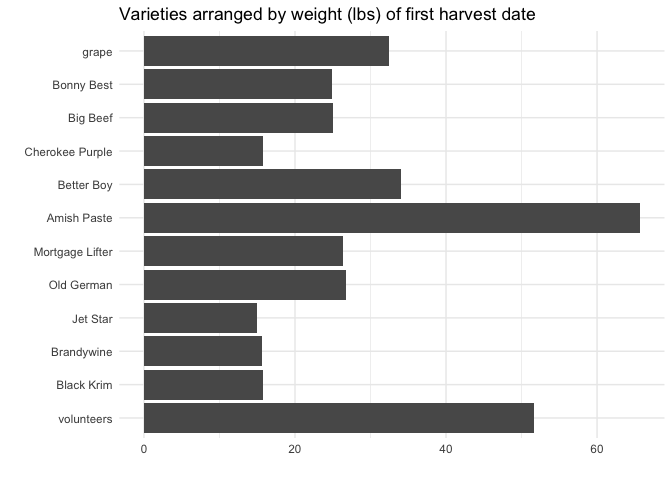<!-- -->

  5. In the `garden_harvest` data, create two new variables: one that makes the varieties lowercase and another that finds the length of the variety name. Arrange the data by vegetable and length of variety name (smallest to largest), with one row for each vegetable variety. HINT: use `str_to_lower()`, `str_length()`, and `distinct()`.
  

```r
garden_harvest %>% 
  mutate(lower_case = str_to_lower(variety),
         length = str_length(variety)) %>% 
  arrange(vegetable,length) %>% 
  distinct(vegetable,variety,lower_case,length)
```

<div data-pagedtable="false">
  <script data-pagedtable-source type="application/json">
{"columns":[{"label":["vegetable"],"name":[1],"type":["chr"],"align":["left"]},{"label":["variety"],"name":[2],"type":["chr"],"align":["left"]},{"label":["lower_case"],"name":[3],"type":["chr"],"align":["left"]},{"label":["length"],"name":[4],"type":["int"],"align":["right"]}],"data":[{"1":"apple","2":"unknown","3":"unknown","4":"7"},{"1":"asparagus","2":"asparagus","3":"asparagus","4":"9"},{"1":"basil","2":"Isle of Naxos","3":"isle of naxos","4":"13"},{"1":"beans","2":"Bush Bush Slender","3":"bush bush slender","4":"17"},{"1":"beans","2":"Chinese Red Noodle","3":"chinese red noodle","4":"18"},{"1":"beans","2":"Classic Slenderette","3":"classic slenderette","4":"19"},{"1":"beets","2":"leaves","3":"leaves","4":"6"},{"1":"beets","2":"Sweet Merlin","3":"sweet merlin","4":"12"},{"1":"beets","2":"Gourmet Golden","3":"gourmet golden","4":"14"},{"1":"broccoli","2":"Yod Fah","3":"yod fah","4":"7"},{"1":"broccoli","2":"Main Crop Bravado","3":"main crop bravado","4":"17"},{"1":"carrots","2":"Dragon","3":"dragon","4":"6"},{"1":"carrots","2":"Bolero","3":"bolero","4":"6"},{"1":"carrots","2":"greens","3":"greens","4":"6"},{"1":"carrots","2":"King Midas","3":"king midas","4":"10"},{"1":"chives","2":"perrenial","3":"perrenial","4":"9"},{"1":"cilantro","2":"cilantro","3":"cilantro","4":"8"},{"1":"corn","2":"Dorinny Sweet","3":"dorinny sweet","4":"13"},{"1":"corn","2":"Golden Bantam","3":"golden bantam","4":"13"},{"1":"cucumbers","2":"pickling","3":"pickling","4":"8"},{"1":"edamame","2":"edamame","3":"edamame","4":"7"},{"1":"hot peppers","2":"thai","3":"thai","4":"4"},{"1":"hot peppers","2":"variety","3":"variety","4":"7"},{"1":"jalapeño","2":"giant","3":"giant","4":"5"},{"1":"kale","2":"Heirloom Lacinto","3":"heirloom lacinto","4":"16"},{"1":"kohlrabi","2":"Crispy Colors Duo","3":"crispy colors duo","4":"17"},{"1":"lettuce","2":"reseed","3":"reseed","4":"6"},{"1":"lettuce","2":"Tatsoi","3":"tatsoi","4":"6"},{"1":"lettuce","2":"mustard greens","3":"mustard greens","4":"14"},{"1":"lettuce","2":"Lettuce Mixture","3":"lettuce mixture","4":"15"},{"1":"lettuce","2":"Farmer's Market Blend","3":"farmer's market blend","4":"21"},{"1":"onions","2":"Delicious Duo","3":"delicious duo","4":"13"},{"1":"onions","2":"Long Keeping Rainbow","3":"long keeping rainbow","4":"20"},{"1":"peas","2":"Magnolia Blossom","3":"magnolia blossom","4":"16"},{"1":"peas","2":"Super Sugar Snap","3":"super sugar snap","4":"16"},{"1":"peppers","2":"green","3":"green","4":"5"},{"1":"peppers","2":"variety","3":"variety","4":"7"},{"1":"potatoes","2":"red","3":"red","4":"3"},{"1":"potatoes","2":"purple","3":"purple","4":"6"},{"1":"potatoes","2":"yellow","3":"yellow","4":"6"},{"1":"potatoes","2":"Russet","3":"russet","4":"6"},{"1":"pumpkins","2":"saved","3":"saved","4":"5"},{"1":"pumpkins","2":"New England Sugar","3":"new england sugar","4":"17"},{"1":"pumpkins","2":"Cinderella's Carraige","3":"cinderella's carraige","4":"21"},{"1":"radish","2":"Garden Party Mix","3":"garden party mix","4":"16"},{"1":"raspberries","2":"perrenial","3":"perrenial","4":"9"},{"1":"rutabaga","2":"Improved Helenor","3":"improved helenor","4":"16"},{"1":"spinach","2":"Catalina","3":"catalina","4":"8"},{"1":"squash","2":"delicata","3":"delicata","4":"8"},{"1":"squash","2":"Red Kuri","3":"red kuri","4":"8"},{"1":"squash","2":"Blue (saved)","3":"blue (saved)","4":"12"},{"1":"squash","2":"Waltham Butternut","3":"waltham butternut","4":"17"},{"1":"strawberries","2":"perrenial","3":"perrenial","4":"9"},{"1":"Swiss chard","2":"Neon Glow","3":"neon glow","4":"9"},{"1":"tomatoes","2":"grape","3":"grape","4":"5"},{"1":"tomatoes","2":"Big Beef","3":"big beef","4":"8"},{"1":"tomatoes","2":"Jet Star","3":"jet star","4":"8"},{"1":"tomatoes","2":"Bonny Best","3":"bonny best","4":"10"},{"1":"tomatoes","2":"Better Boy","3":"better boy","4":"10"},{"1":"tomatoes","2":"Old German","3":"old german","4":"10"},{"1":"tomatoes","2":"Brandywine","3":"brandywine","4":"10"},{"1":"tomatoes","2":"Black Krim","3":"black krim","4":"10"},{"1":"tomatoes","2":"volunteers","3":"volunteers","4":"10"},{"1":"tomatoes","2":"Amish Paste","3":"amish paste","4":"11"},{"1":"tomatoes","2":"Cherokee Purple","3":"cherokee purple","4":"15"},{"1":"tomatoes","2":"Mortgage Lifter","3":"mortgage lifter","4":"15"},{"1":"zucchini","2":"Romanesco","3":"romanesco","4":"9"}],"options":{"columns":{"min":{},"max":[10]},"rows":{"min":[10],"max":[10]},"pages":{}}}
  </script>
</div>

  6. In the `garden_harvest` data, find all distinct vegetable varieties that have "er" or "ar" in their name. HINT: `str_detect()` with an "or" statement (use the | for "or") and `distinct()`.


```r
garden_harvest %>% 
  filter(str_detect(variety,"ar|er")) %>% 
  distinct(vegetable,variety)
```

<div data-pagedtable="false">
  <script data-pagedtable-source type="application/json">
{"columns":[{"label":["vegetable"],"name":[1],"type":["chr"],"align":["left"]},{"label":["variety"],"name":[2],"type":["chr"],"align":["left"]}],"data":[{"1":"radish","2":"Garden Party Mix"},{"1":"lettuce","2":"Farmer's Market Blend"},{"1":"peas","2":"Super Sugar Snap"},{"1":"chives","2":"perrenial"},{"1":"strawberries","2":"perrenial"},{"1":"asparagus","2":"asparagus"},{"1":"lettuce","2":"mustard greens"},{"1":"raspberries","2":"perrenial"},{"1":"beans","2":"Bush Bush Slender"},{"1":"beets","2":"Sweet Merlin"},{"1":"hot peppers","2":"variety"},{"1":"tomatoes","2":"Cherokee Purple"},{"1":"tomatoes","2":"Better Boy"},{"1":"peppers","2":"variety"},{"1":"tomatoes","2":"Mortgage Lifter"},{"1":"tomatoes","2":"Old German"},{"1":"tomatoes","2":"Jet Star"},{"1":"carrots","2":"Bolero"},{"1":"tomatoes","2":"volunteers"},{"1":"beans","2":"Classic Slenderette"},{"1":"pumpkins","2":"Cinderella's Carraige"},{"1":"squash","2":"Waltham Butternut"},{"1":"pumpkins","2":"New England Sugar"}],"options":{"columns":{"min":{},"max":[10]},"rows":{"min":[10],"max":[10]},"pages":{}}}
  </script>
</div>


## Bicycle-Use Patterns

In this activity, you'll examine some factors that may influence the use of bicycles in a bike-renting program.  The data come from Washington, DC and cover the last quarter of 2014.

<center>

{width="30%"}


{width="30%"}

</center>

Two data tables are available:

- `Trips` contains records of individual rentals
- `Stations` gives the locations of the bike rental stations

Here is the code to read in the data. We do this a little differently than usual, which is why it is included here rather than at the top of this file. To avoid repeatedly re-reading the files, start the data import chunk with `{r cache = TRUE}` rather than the usual `{r}`.


```r
data_site <- 
  "https://www.macalester.edu/~dshuman1/data/112/2014-Q4-Trips-History-Data.rds" 
Trips <- readRDS(gzcon(url(data_site)))
Stations<-read_csv("http://www.macalester.edu/~dshuman1/data/112/DC-Stations.csv")
```

```
## Rows: 347 Columns: 5
```

```
## ── Column specification ────────────────────────────────────────────────────────
## Delimiter: ","
## chr (1): name
## dbl (4): lat, long, nbBikes, nbEmptyDocks
```

```
## 
## ℹ Use `spec()` to retrieve the full column specification for this data.
## ℹ Specify the column types or set `show_col_types = FALSE` to quiet this message.
```

**NOTE:** The `Trips` data table is a random subset of 10,000 trips from the full quarterly data. Start with this small data table to develop your analysis commands. **When you have this working well, you should access the full data set of more than 600,000 events by removing `-Small` from the name of the `data_site`.**

### Temporal patterns

It's natural to expect that bikes are rented more at some times of day, some days of the week, some months of the year than others. The variable `sdate` gives the time (including the date) that the rental started. Make the following plots and interpret them:

  7. A density plot, which is a smoothed out histogram, of the events versus `sdate`. Use `geom_density()`.
  

```r
Trips %>% 
  ggplot(aes(x=sdate))+
  geom_density()+
  scale_y_continuous(labels=scales::comma)+
  labs(title="Density of bike usage per date", x="", y="")
```

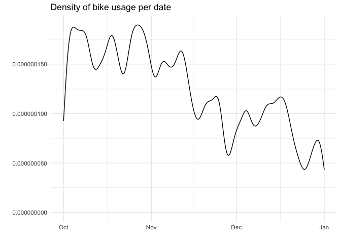<!-- -->
  
  8. A density plot of the events versus time of day.  You can use `mutate()` with `lubridate`'s  `hour()` and `minute()` functions to extract the hour of the day and minute within the hour from `sdate`. Hint: A minute is 1/60 of an hour, so create a variable where 3:30 is 3.5 and 3:45 is 3.75.
  

```r
Trips %>% 
  mutate(hr = hour(sdate), minutes = minute(sdate)*1/60,
         hr_minute= hr+minutes) %>% 
  ggplot(aes(x=hr_minute))+
  geom_density()+
  labs(x=" ", y=" ", title=" Density of rentals by the hour")
```

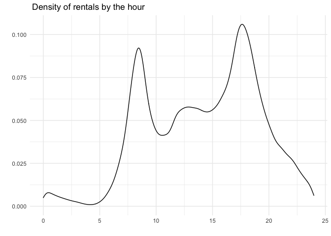<!-- -->
  
  9. A bar graph of the events versus day of the week. Put day on the y-axis.
  

```r
Trips%>%
  mutate(day_week=wday(sdate)) %>% 
  group_by(day_week) %>% 
  ggplot()+
  geom_bar(aes(y=day_week))+
  labs(x=" ", title=" Events per day of the week",y="Day of the week (1=sunday)")
```

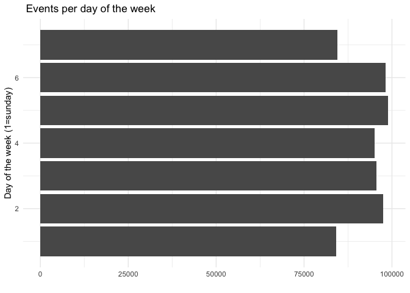<!-- -->
  
  10. Facet your graph from exercise 8. by day of the week. Is there a pattern?
  

```r
Trips %>% 
  mutate(hr = hour(sdate), minutes = minute(sdate)*1/60,
         hr_minute= hr+minutes) %>% 
  ggplot(aes(x=hr_minute))+
  geom_density()+
  facet_wrap(~wday(sdate))+
  labs(x=" ", y=" ", title=" Density of rentals by the hour per day of the week")
```

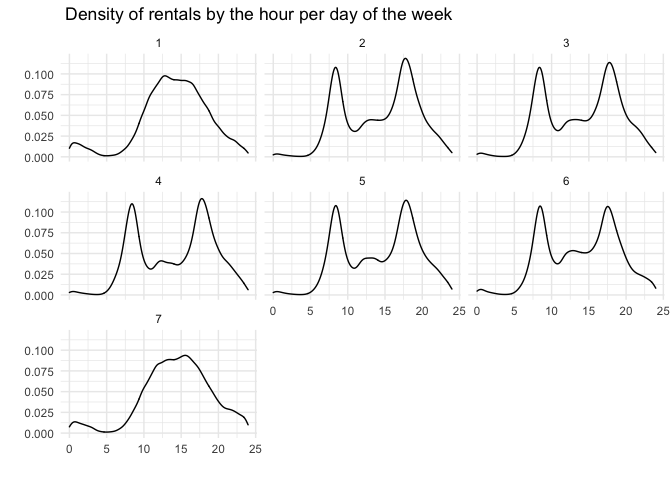<!-- -->
  
  It seems like there are certain times of the day where more bikes are being rented, for example, from 5 am to 8 am. On the other hand there seems like at some other hours the number of bikes rented decline. These are usually late at night after 5 pm.

The variable `client` describes whether the renter is a regular user (level `Registered`) or has not joined the bike-rental organization (`Causal`). The next set of exercises investigate whether these two different categories of users show different rental behavior and how `client` interacts with the patterns you found in the previous exercises. 

  11. Change the graph from exercise 10 to set the `fill` aesthetic for `geom_density()` to the `client` variable. You should also set `alpha = .5` for transparency and `color=NA` to suppress the outline of the density function.
  

```r
Trips %>% 
  mutate(hr = hour(sdate), minutes = minute(sdate)*1/60,
         hr_minute= hr+minutes) %>% 
  ggplot(aes(x=hr_minute))+
  geom_density(aes(fill=client),alpha= 0.5, color=NA)+
  facet_wrap(~wday(sdate))+
  labs(x=" ", y=" ", title="Density of rentals by the hour per day of the week by type of client")
```

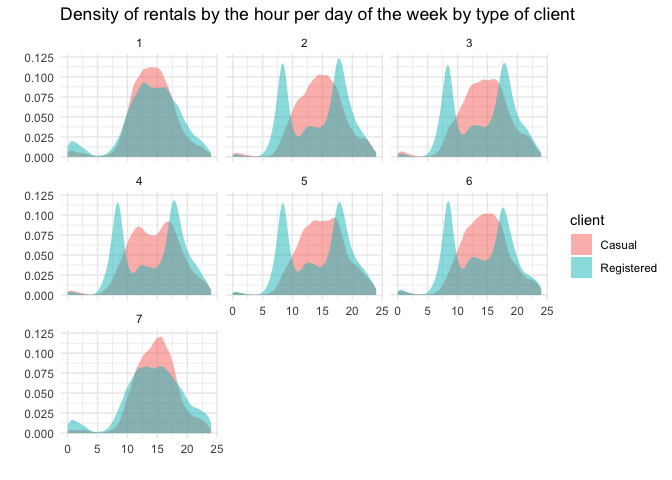<!-- -->

  12. Change the previous graph by adding the argument `position = position_stack()` to `geom_density()`. In your opinion, is this better or worse in terms of telling a story? What are the advantages/disadvantages of each?
  

```r
Trips %>% 
  mutate(hr = hour(sdate), minutes = minute(sdate)*1/60,
         hr_minute= hr+minutes) %>% 
  ggplot(aes(x=hr_minute))+
  geom_density(aes(fill=client),alpha= 0.5, color=NA,position=position_stack())+
  facet_wrap(~wday(sdate))+
  labs(x=" ", y=" ", title="Density of rentals by the hour per day of the week by type of client")
```

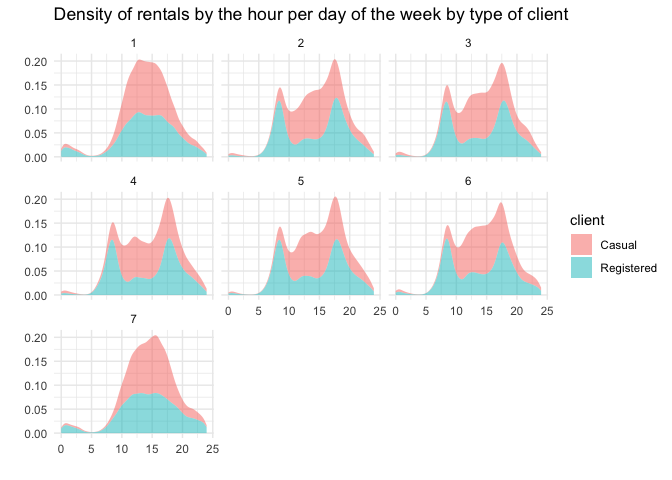<!-- -->
  
  I personally like more the graph in question 11. It is easier to compare if we can see where both densities start and compare where the overlap of the graphs gets delimited. However, the second graph seems somehow easier to get overall information from given that the graphs are stacked,
  
  13. In this graph, go back to using the regular density plot (without `position = position_stack()`). Add a new variable to the dataset called `weekend` which will be "weekend" if the day is Saturday or Sunday and  "weekday" otherwise (HINT: use the `ifelse()` function and the `wday()` function from `lubridate`). Then, update the graph from the previous problem by faceting on the new `weekend` variable. 
  

```r
Trips %>% 
  mutate(hr = hour(sdate), minutes = minute(sdate)*1/60,
         hr_minute= hr+minutes,
         weekend = ifelse(wday(sdate) < 6, "weekday","weekend")) %>% 
  ggplot(aes(x=hr_minute))+
  geom_density()+
  facet_wrap(~weekend)+
  labs(x=" ", y=" ", title="Density of rentals by the hour for weekdays and weekends")
```

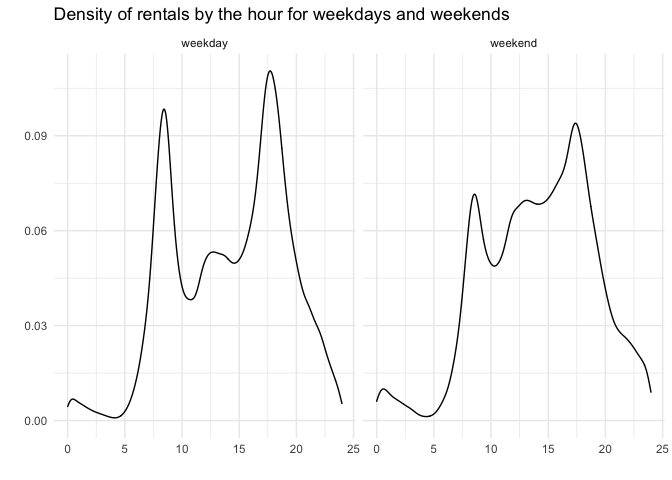<!-- -->
  
  14. Change the graph from the previous problem to facet on `client` and fill with `weekday`. What information does this graph tell you that the previous didn't? Is one graph better than the other?
  

```r
Trips %>% 
  mutate(hr = hour(sdate), minutes = minute(sdate)*1/60,
         hr_minute= hr+minutes,
         weekend = ifelse(wday(sdate) < 6, "weekday","weekend")) %>% 
  ggplot(aes(x=hr_minute))+
  geom_density(aes(fill=weekend),alpha= 0.5, color=NA)+
  facet_wrap(~client)+
  labs(x=" ", y=" ", title="Density of rentals by the hour and type of client for weekends and weekdays")
```

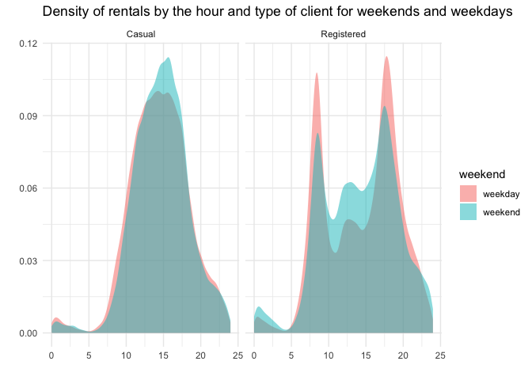<!-- -->
  It allows us to differentiate by casual and registered users, weekday and weekend and distinguish by the hour of the day. While the previous graph only allows us to distinguish by hour of the day and weekend/weekday.
  
### Spatial patterns

  15. Use the latitude and longitude variables in `Stations` to make a visualization of the total number of departures from each station in the `Trips` data. Use either color or size to show the variation in number of departures. We will improve this plot next week when we learn about maps!
  

```r
Trips %>% 
  mutate(name = sstation) %>% 
  left_join(Stations, by= c("name")) %>% 
  group_by(name, lat,long) %>% 
  summarise(n=n()) %>% 
  ggplot(aes(x=long,y=lat))+
  geom_point(aes(size= n))+
  scale_color_viridis_c()+
  labs(title="Total departures from each station", x="longitude",y="latitude")
```

```
## `summarise()` has grouped output by 'name', 'lat'. You can override using the `.groups` argument.
```

```
## Warning: Removed 12 rows containing missing values (geom_point).
```

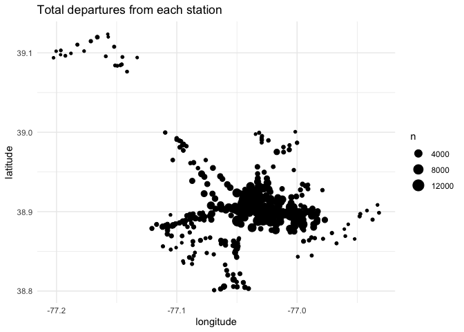<!-- -->
  
  16. Only 14.4% of the trips in our data are carried out by casual users. Create a plot that shows which area(s) have stations with a much higher percentage of departures by casual users. What patterns do you notice? (Again, we'll improve this next week when we learn about maps).
  

```r
Trips %>% 
  group_by(sstation) %>% 
  summarise(casual= sum(client == "Casual"),ntotal=n()) %>% 
  mutate(portionCasual= casual/ntotal) %>% 
  left_join(Stations, by=c("sstation"="name")) %>% 
  ggplot(aes(x=long, y=lat))+
  geom_point(aes(color= portionCasual))+
  scale_color_viridis_c()+
  labs(title="Total departures from each station", x="longitude",y="latitude")
```

```
## Warning: Removed 12 rows containing missing values (geom_point).
```

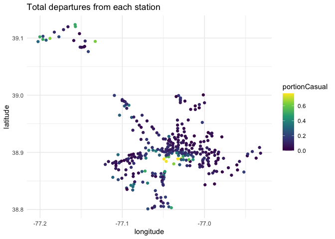<!-- -->
  
**DID YOU REMEMBER TO GO BACK AND CHANGE THIS SET OF EXERCISES TO THE LARGER DATASET? IF NOT, DO THAT NOW.**

## Dogs!

In this section, we'll use the data from 2022-02-01 Tidy Tuesday. If you didn't use that data or need a little refresher on it, see the [website](https://github.com/rfordatascience/tidytuesday/blob/master/data/2022/2022-02-01/readme.md).

  17. The final product of this exercise will be a graph that has breed on the y-axis and the sum of the numeric ratings in the `breed_traits` dataset on the x-axis, with a dot for each rating. First, create a new dataset called `breed_traits_total` that has two variables -- `Breed` and `total_rating`. The `total_rating` variable is the sum of the numeric ratings in the `breed_traits` dataset (we'll use this dataset again in the next problem). Then, create the graph just described. Omit Breeds with a `total_rating` of 0 and order the Breeds from highest to lowest ranked. You may want to adjust the `fig.height` and `fig.width` arguments inside the code chunk options (eg. `{r, fig.height=8, fig.width=4}`) so you can see things more clearly - check this after you knit the file to assure it looks like what you expected.


```r
breed_traits_total<- breed_traits %>% 
  group_by(Breed) %>% 
  summarise(total_rating=sum(`Affectionate With Family`,`Good With Other Dogs`,`Good With Young Children`,`Shedding Level`,`Coat Grooming Frequency`,`Drooling Level`,`Openness To Strangers`,`Playfulness Level`,`Watchdog/Protective Nature`,`Adaptability Level`,`Trainability Level`,`Energy Level`,`Barking Level`,`Mental Stimulation Needs`)) %>% 
  filter(total_rating!=0) %>% 
  arrange(desc(total_rating))

breed_traits_total%>% 
  ggplot(aes(y=fct_reorder(Breed,total_rating),x=total_rating)) +
  geom_point()+
  labs(title="Total rating per Breed", x= " ", y=" ")
```

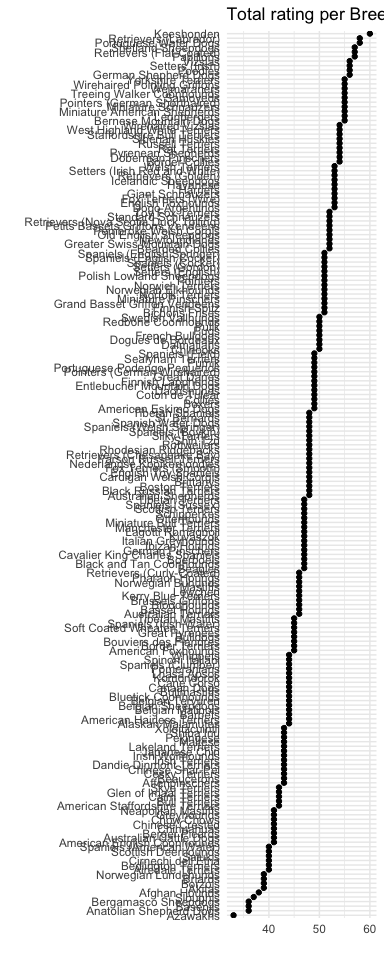<!-- -->

  18. The final product of this exercise will be a graph with the top-20 dogs in total ratings (from previous problem) on the y-axis, year on the x-axis, and points colored by each breed's ranking for that year (from the `breed_rank_all` dataset). The points within each breed will be connected by a line, and the breeds should be arranged from the highest median rank to lowest median rank ("highest" is actually the smallest numer, eg. 1 = best). After you're finished, think of AT LEAST one thing you could you do to make this graph better. HINTS: 1. Start with the `breed_rank_all` dataset and pivot it so year is a variable. 2. Use the `separate()` function to get year alone, and there's an extra argument in that function that can make it numeric. 3. For both datasets used, you'll need to `str_squish()` Breed before joining. 
  

```r
top20 <- breed_traits_total %>% 
  mutate(Breed_squished= str_squish(Breed)) %>% 
  slice(1:20)

breed_rank_all %>% 
  pivot_longer(cols = starts_with("20"),
               names_to = "Year",
               values_to = "Rank") %>% 
  separate(Year,into=c("Year","deletable")) %>% 
  select(-links,-Image,-deletable) %>% 
  mutate(Breed_squished= str_squish(Breed)) %>% 
  right_join(top20, by=c("Breed"="Breed_squished")) %>% 
  group_by(Breed) %>% 
  mutate(median= median(Rank)) %>% 
  ggplot(aes(y=fct_reorder(Breed,desc(median)),x=Year,color=Rank)) +
  geom_point()+
  scale_color_viridis_c()+
  labs(title="Rank per year for the 20 highest rated dogs",x=" ", y=" ")
```

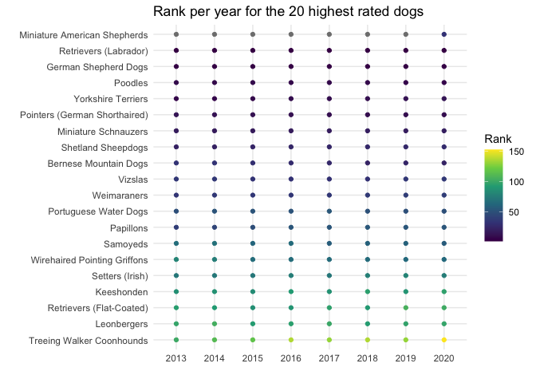<!-- -->
  
  19. Create your own! Requirements: use a `join` or `pivot` function (or both, if you'd like), a `str_XXX()` function, and a `fct_XXX()` function to create a graph using any of the dog datasets. One suggestion is to try to improve the graph you created for the Tidy Tuesday assignment. If you want an extra challenge, find a way to use the dog images in the `breed_rank_all` file - check out the `ggimage` library and [this resource](https://wilkelab.org/ggtext/) for putting images as labels.
  

```r
top20_worstDoggos <- breed_traits_total %>% 
  slice(-1:-174)

breed_rank_all %>% 
  pivot_longer(cols = starts_with("20"),
               names_to = "Year",
               values_to = "Rank") %>% 
  separate(Year,into=c("Year","deletable")) %>% 
  select(-links,-Image,-deletable) %>% 
  right_join(top20_worstDoggos, by="Breed") %>% 
  group_by(Breed) %>% 
  mutate(median= median(Rank)) %>% 
  ggplot(aes(y=fct_reorder(Breed,desc(median)),x=Year,color=Rank, na.rm = TRUE)) +
  geom_point()+
  scale_color_viridis_c()+
  labs(title="Rank per year for the 20 lowest rated dogs",x=" ", y=" ")
```

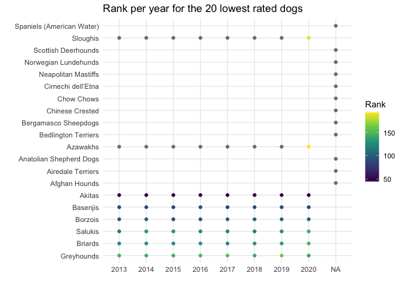<!-- -->

## GitHub link

  20. Below, provide a link to your GitHub page with this set of Weekly Exercises. Specifically, if the name of the file is 03_exercises.Rmd, provide a link to the 03_exercises.md file, which is the one that will be most readable on GitHub.
  
  [link](https://github.com/MarcelaSaavedraG/marcela_test_repo/tree/main/Exercises)

## Challenge problem! 

This problem uses the data from the Tidy Tuesday competition this week, `kids`. If you need to refresh your memory on the data, read about it [here](https://github.com/rfordatascience/tidytuesday/blob/master/data/2020/2020-09-15/readme.md). 

  21. In this exercise, you are going to try to replicate the graph below, created by Georgios Karamanis. I'm sure you can find the exact code on GitHub somewhere, but **DON'T DO THAT!** You will only be graded for putting an effort into this problem. So, give it a try and see how far you can get without doing too much googling. HINT: use `facet_geo()`. The graphic won't load below since it came from a location on my computer. So, you'll have to reference the original html on the moodle page to see it.


**DID YOU REMEMBER TO UNCOMMENT THE OPTIONS AT THE TOP?**
