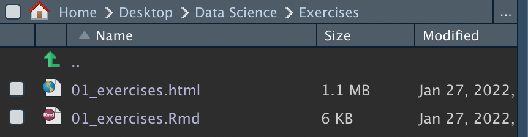
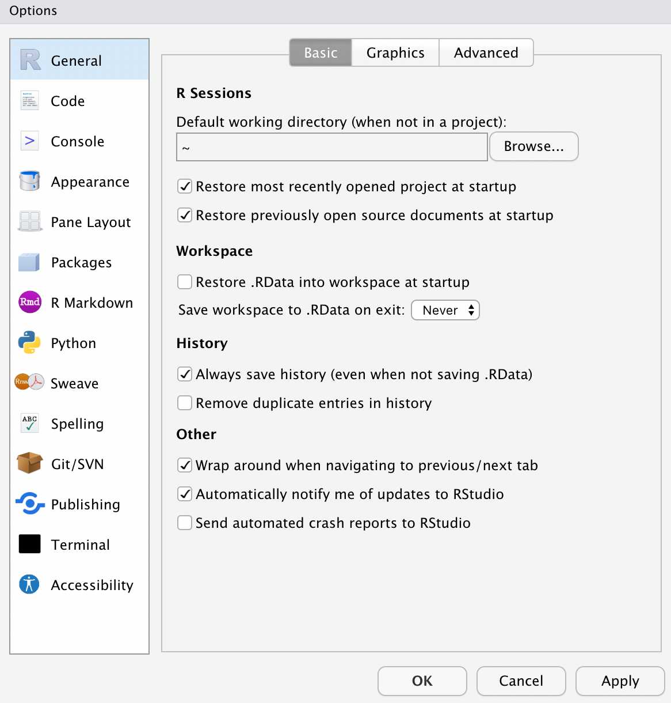

## Introduction and setup

```{r setup, include=FALSE}
#knitr::opts_chunk$set(echo = TRUE, message=FALSE, warning=FALSE)
```

```{r libraries}
library(tidyverse)         # for graphing and data cleaning
library(palmerpenguins)     # for penguin data
```

```{r data}
data(penguins) #load Palmer penguin data
```

First, if you just downloaded this file from the moodle page, you will want the R Markdown file that has the code in it. Click the Code button in the upper, right corner of this document and choose *Download Rmd* to download the R Markdown file.  Save it in the folder you created for this class (NOT in the downloads folder!!!). It will likely go to your downloads first. You can either manually move it to the folder for this class or you can open it (double click) in R Studio and then do File --> Save As and put it in the folder for this class.

Throughout this assignment, it will help to have both the *R Markdown Reference Guide* (from within R Studio, Help -> Cheatsheets --> *R Markdown Reference Guide*) and `ggplot2` cheatsheet (Help --> Cheatsheets --> *Data vizualization with ggplot2*) open. 

Without making any changes to this document, click the Knit button at the top (either click on the icon above that looks like a ball of yarn with knitting needles in it, or click the arrow next to that and choose knit to html), which will turn it into an html file. When you do this, another window will pop up that gives you a preview of what it will look like. You can also go see the actual file that was created. In order to do that, navigate to the folder where you saved this file. This file will be there, along with another file that has the same name but ends in .html. When you open that file, it will open in your default web browser.

## Using R markdown exercises

  1. At the top of the document, where it says "PUT YOUR NAME HERE", do that. Keep it inside the quotes.

  2. Write the name of your hometown in bold below, next to where it says "Hometown:".

 ** Hometown: Tulua **

 3. Write the name of one of the people in your group in italics below (if you're not in a group, write the name of a friend).

  *Name: Emily Oceane*

  4. Take a screenshot showing both this .Rmd file and the knitted .html file in the folder where they are located. Include the screenshot below. HINT: save the screenshot in the same folder where this file is located and use `` to include the image --> check the *R Markdown Reference Guide* for more information. Knit your file again to make sure you don't get any errors. 
  

Put the image on the next line:




  5. Provide a link to your favorite restaurant, but make the words "My favorite restaurant" be the link you click on in the document. I have started this for you below, but you'll have to make some changes to make it work.

  [My favorite restaurant](https://stadtgefluester-dreieich.de/)

## R setup exercises

  6. Run the R code chunk below that will tell you your R version. Make sure you have version 4.1.0 or larger. **Remove the `eval=FALSE` from the code chunk!!** If you need to update R (and R Studio, for that matter) see [R Basics: Installation](https://r-basics.netlify.app/#Installation).
  
```{r}
R.Version()
```
   
  7. Go to Tools --> Global Options and take a screen shot of the general tab so I can see that you have made the changes you were instructed to make in the [R Basics: Setting up for succes](https://r-basics.netlify.app/#Setting_up_for_success) section. Include the screenshot below. (See exercise 4 if you need to remember how to include an image).
  
  

  8. In the 2nd R code chunk above, uncomment the `library()` statements by deleting the pound signs (`#`) in front of them. If you haven't already installed both of those libraries. You can either go to the packages tab in the bottom right corner, click install, and type the names of the packages. Or, run `install.packages("tidyverse")` and `install.packages("palmerpenguins")` in the console below. If you have already installed these packages, you do not need to re-install them. If you are using the server, you also should not need to install them (if you get errors, talk to your instructore). Run the library code chunk. Knit the document to assure you don't have any errors.
  
  9. Uncomment the data code chunk above and run it to load the Palmer penguin data. Add an R code chunk where you use the `dim()` function to tell you how many cases and variables are in the dataset. How many cases are there? How many variables are there?
  
```{r}
dim(penguins)
```
  
  There are 344 cases and 8 variables
  
## Data and graphing exercises

Go through the `ggplot()` portion of the *ggplot_dplyr_intro* tutorial before doing the next exercises which will use the `penguins` dataset.

  10. *In the console* (not in an R code chunk), run `?penguins`. Give a brief description below of what this dataset is about.  
  
  The data set contains information on 344 penguins from Palmer Archipielago. The different measurments taken per penguins include the flipper length, body mass, bill dimensions and sex.
  
  11. Create a histogram that shows the distribution of bill length. Provide a title and label the x and y axes, if needed. Change the fill color. Look [here](http://sape.inf.usi.ch/quick-reference/ggplot2/colour) for some color options. How would you describe the distribution? For an extra challenge, try adding a vertical line to indicate the mean bill length (HINT: `geom_vline()`).
  
```{r}
penguins %>% 
  ggplot(aes(x=bill_length_mm))+
  geom_histogram(fill="tomato4")+
  geom_vline(aes(xintercept=mean(bill_length_mm,na.rm=TRUE)))+
  labs(title="Bill length distribution",
       x=" Bill length (mm)",
       y="Count")
```
  The distribution seem to have two peaks at around 38 and 48. 
  
  
  12. Create a plot to examine the relationship between bill length and bill depth. Color the points by species. Add x and y labels, if needed. Try a different theme (if you want, you can even try some from the `ggtheme` library!). How would you describe the relationship? Does it change depending on species?
  
```{r}
penguins %>% 
  ggplot(aes(x=bill_length_mm,y=bill_depth_mm,color=species))+
  geom_point()+
  labs(title="Relationship between bill length and bill depth",
       x="Bill length (mm)",
       y="Bill depth (mm)")+
  ggthemes::scale_colour_economist()
  
```
  
  
  13. Create side-by-side boxplots to compare the bill length by sex. Put sex on the y axis. What do you observe? Make a comparison.
  
```{r}
penguins %>% 
  ggplot(aes(y=sex,x=bill_length_mm))+
  geom_boxplot()+
  labs(title="Bill length per sex", y="Sex", x="Bill length (mm)")
```
  It seems like males have on average greater bill lengths than female penguins.
  
  14. Add a faceting layer to the previous problem to make separate plots for each species. Does this show anything new?
  
```{r}
penguins %>% 
  ggplot(aes(y=sex,x=bill_length_mm))+
  geom_boxplot()+
  labs(title="Bill length per sex", y="Sex", x="Bill length (mm)")+
  facet_wrap(~species)
```
  It seems like Adelie penguns both males and females have lower bill lengths than the other two penguin species.
  
  15. Explore some YAML themes! Use a new theme for this document. See my documentation [here](https://r-basics.netlify.app/#Themes) and be sure to watch the video at the beginning of the R Markdown section.
  
 
  
