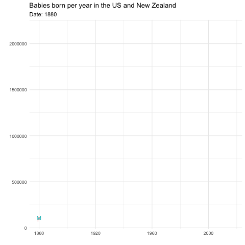

```{r setup, include=FALSE, echo=FALSE}
#knitr::opts_chunk$set(echo = TRUE, error=TRUE, message=FALSE, warning=FALSE)
```

```{r libraries, echo=FALSE}
library(tidyverse)     # for graphing and data cleaning
library(lubridate)     # for date manipulation
library(ggthemes)      # for even more plotting themes
theme_set(theme_minimal()) # My favorite ggplot() theme :)
```

## Data choice 1: Baby Names

```{r, echo=FALSE}
# Read in the data

babynames <- readr::read_csv('https://raw.githubusercontent.com/rfordatascience/tidytuesday/master/data/2022/2022-03-22/babynames.csv')
```

This week's data should be familiar from previous exercises. There is data for both babynames from New Zealand and the US. Read more about it, including definitions of variables, [here](https://github.com/rfordatascience/tidytuesday/blob/master/data/2022/2022-03-22/readme.md). 

How did the babies born in the US and New Zealand changed throughout the years as shown by the baby names registered?

```{r}
babies_born <- babynames %>% 
  group_by(year, sex) %>% 
  summarize(total_babies= sum(n))
  
head(babies_born)
```

```{r, eval=FALSE, alt.fig= "The intent of this graph is to show the changes in the number of babies born each year per sex. This number was obtained from the addition of total names registered per year."}
babies_born_animated <- babies_born %>% 
  ggplot(aes(x=year,y=total_babies, color = sex)) +
  geom_line()+
  geom_text(aes(label = sex))+
  labs(title= "Babies born per year in the US and New Zealand", x= " ", y= " ",
       subtitle= "Date: {frame_along}")+
  theme(legend.position = "none")+
  transition_reveal(as.integer(year))

anim_save("babies_born_animated.gif")
```

```{r}

```

It is interesting to see how the number of babies born per year fluctuated over the years. What is more interesting is to see how there is a growing trend of babies born overall. This makes me think especially of the concerns of shrinking populations, it seems that if the trend is sustained, maybe there is nothing to worry about, that is, assuming this trend can be translated to other countries (big assumption!). Also, it is fun to see how there is not a especial pattern when it comes to comparing babies born per sex. During the first years of available data, there were more females being registered, but then, it was males who took the lead.
